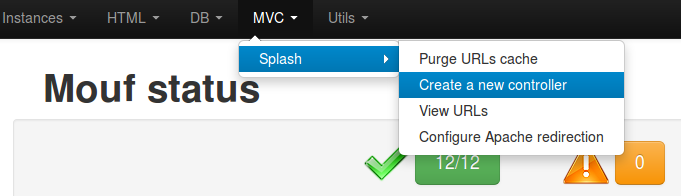
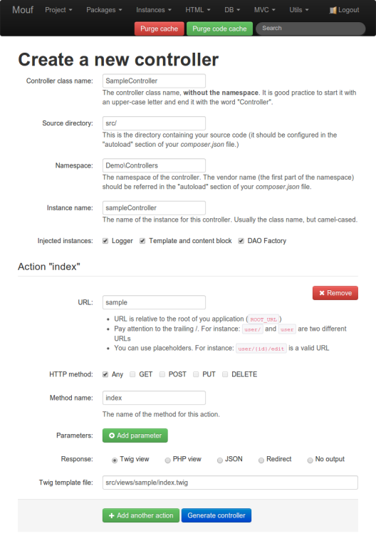

Writing controllers
===================

What is a controller?
---------------------

In Splash, a controller is a class that contains a number of _Actions_.
_Actions_ are methods that can be directly accessed from the browser.
What binds a URL to an action is called a _route_.

Controllers can be created very easily, using Splash user interface. Check it out!

<iframe width="640" height="480" src="//www.youtube.com/embed/Jnsu1rpgD7g" frameborder="0" allowfullscreen></iframe>

Creating a controller using Splash's wizard
-------------------------------------------

For your application to print some HTML when you call a URL, you need 4 things:

- A **controller** class: this is the class that will contain the actions declaration
- **Actions** methods: these are the methods that will be called when a URL is called
- A controller **instance**, declared in Mouf: you must create one instance of your class in Mouf (usually, only one instance)
- **Views**: these are files that contain the HTML to be outputed. We keep the HTML out of the controller to make the code 
  more readable and to separate concerns between the controller (in charge of the logic) and the view (in charge of the rendering)

The Splash create-a-controller wizard will create those 4 things for you.

Let's start. Go in the **MVC** > **Splash** > **Create a new controller** menu.



You will be displayed a page you can use to create your controller.



Use this page to configure your controller! You can add as many actions as you want, you can even
decide what parameters must be passed to those actions.
You shall also decide what instances should be injected by default in your controller (you can of
course later change the class code and add more properties to the controller).

By default, you can inject in your controller:

- a logger
- an HTML template
- the content block of the HTML template
- the [TDBM DAO factory](http://mouf-php.com/packages/mouf/database.tdbm/index.md) (if you are using TDBM)


The @URL annotation
-------------------

Have a look at the actions that have been declared:

```php
<?php
	/**
	 * @URL("test/action")
	 * @param int $var1
	 * @param int $var2
	 */
	public function index($var1 = 0, $var2 = 0) { ... }
?>
```

The *@URL* annotation points to the web path the action is bound to.

The action takes 2 parameters: var1 and var2. This means that the page needs both parameters passed 
either in GET or POST.

The @Get / @Post annotations
----------------------------

We might decide that an action should always be called via GET, or via POST (or PUT or DELETE if you want to provide REST services).
Splash makes that very easy to handle. You can just add a @Get or @Post annotation (or @Put or @Delete). Here is a sample:

```php
<?php
namespace Test\Controllers;

use Zend\Diactoros\Response\HtmlResponse;
use TheCodingMachine\Splash\Annotations\URL;

/**
 * This is a sample user controller.
 *
 */
class UserController {
	
	/**
	 * Viewing the user is performed by a @Get.
	 *
	 * @URL("/user")
	 * @Get
	 * @param string $id
	 */
	public function viewUser($id) {
		 return new HtmlResponse("Here, we might put the form for user ".htmlentities($id));
	}

	/**
	 * Modifying the user is performed by a @Post.
	 *
	 * @URL("/user")
	 * @Post
	 * @param string $id
	 * @param string $name
	 * @param string $email
	 */
	public function editUser($id, $name, $email) {
		 return new HtmlResponse("Here, we might put the code to change the user object.");
	}

}
```

In the example above (a sample controller to view/modify users), the "/user" URL is bound to 2 different methods
based in the HTTP method used to access this URL.

Parametrized URLs
-----------------

You can put parameters in the URLs and fetch them very easily:

```php
<?php
use TheCodingMachine\Splash\Annotations\URL;

/**
 * This is a sample user controller.
 *
 */
class UserController {
	
	/**
	 * Viewing the user is performed by a @Get.
	 *
	 * @URL("/user/{id}/view")
	 * @Get
	 * @param string $id
	 */
	public function viewUser($id) {
		 return new HtmlResponse("Here, we might put the form for user ".htmlentities($id));
	}
}
?>
```

Do you see the @URL annotation? The {id} part is a placeholder that will be replaced by any value found in the URL.
So for instance, if you access http://[server]/[appname]/user/42/view, the $id parameter will be filled with "42". 

