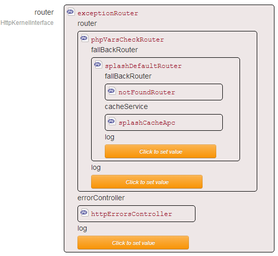

Since version 7.0, Splash implements a routing system based on [Stratigility](https://github.com/laminas/laminas-stratigility).

The basics
----------

Splash has a "middleware stack". Splash will give the Request to the first middleware that will handle it.
Eventually, the first middleware will forward it to the next one. The second middleware will maybe
forward the request to the third middleware, and so on...

**Note:** Some middlewares can, in fact, be considered as filters.

Splash's default middleware implementation
-------------------------------------------
Here is the Splash instance view after installation :



If you look closer at the stack, here is what you will find out :

```php
> PhpVarsCheckRouter // Checks if max_input_vars and max_post_size have not been exceeded
> SplashDefaultRouter // Main router (will find a matching Route (controller / actions), and return the HTML
> NotFoundRouter // No router has been able to handle the Request, return a 404 response
> ExceptionRouter // Surround the router stack with a try/catch statement, and handle Exceptions display
```

The `PhpVarsCheckRouter` should be placed at the beginning of the stack, and at least before the "effective" routers
The `NotFoundRouter` should always be the last but one.
The `Exception` router should always be the last one

Adding your own router into the stack
-------------------------------------

To do so, you just need to create an instance of a middleware. Check the [Stratigility](https://github.com/laminas/laminas-stratigility) documentation.

There are many existing PSR-7 middlewares that you can use and add to the pipeline.
